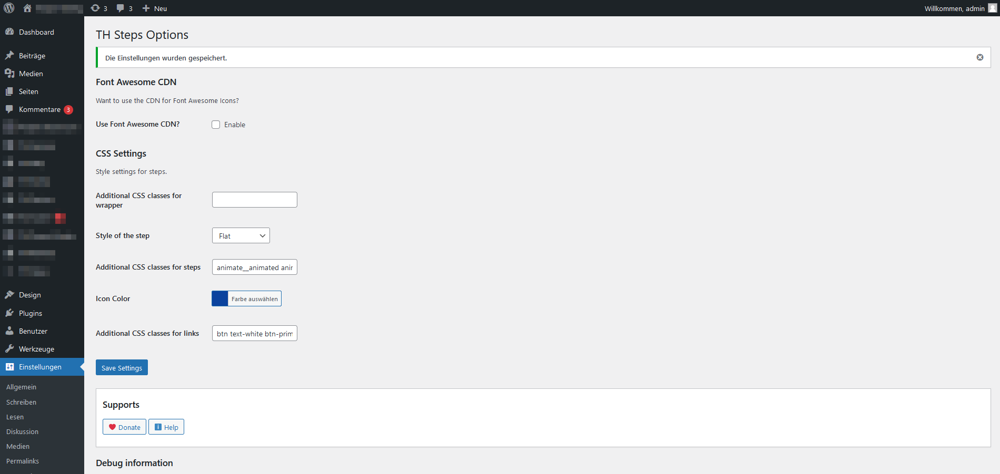
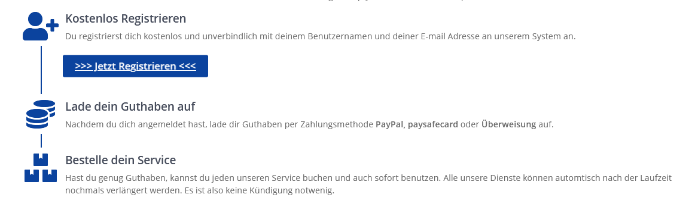

# TH Steps
Contributors: triopsi
Donate link: https://www.paypal.me/triopsi
Tags: steps, step, shortcode, post, site
Requires at least: 5.3
Tested up to: 5.7
Requires PHP: 5.4
Stable tag: 1.0.0
License: GPLv2
License URI: https://www.gnu.org/licenses/gpl-2.0
 
A simple HTML stepper that works with categories and is also easy to use.
 
## Description

The "TH Steps" plugin is a very simple way of displaying steps, e.g. for a registration or shop on a website. It has an attractive design
and is very easy to use. Copy the [thsteps category=""] shortcode and paste it anywhere in your post or website to display a category's steps.

# Create features
 
* Create and manage the steps
* Add Shortcodes in your post or sites 
* Responsives designs
* Steps are assigned into categories

# Bugs, technical hints or contribute

Please give me feedback, contribute and file technical bugs on [GitHub Repository](https://github.com/triopsi/th-steps). Thanks :)

# Credits

Developed by [Triopsi](https://triopsi-hosting.com)

## Installation
 
1. Upload `th-faq` to the `/wp-content/plugins/` directory
1. Activate the plugin through the 'Plugins' menu in WordPress
 
## Frequently Asked Questions
 
Nothing yet.
 
## Screenshots

1. Steps Design Flat

2. Settings

3. Steps Design Stairs
 
4. Edit/Save Steps

## Changelog

# 1.0.0
* First release.

## Upgrade Notice

Nothing.

## Donations

If you like the plugin, consider a donation to support further development. [Click here](https://www.paypal.me/triopsihosting)
 
